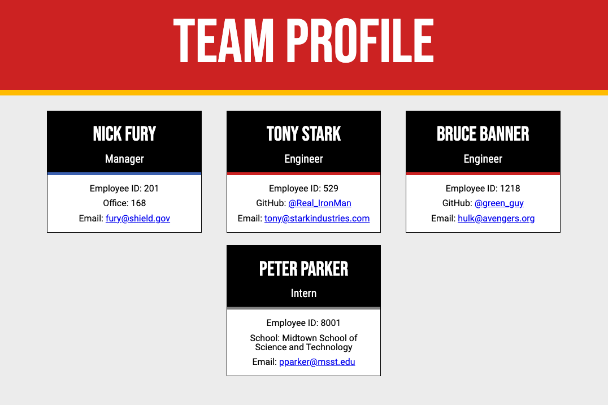
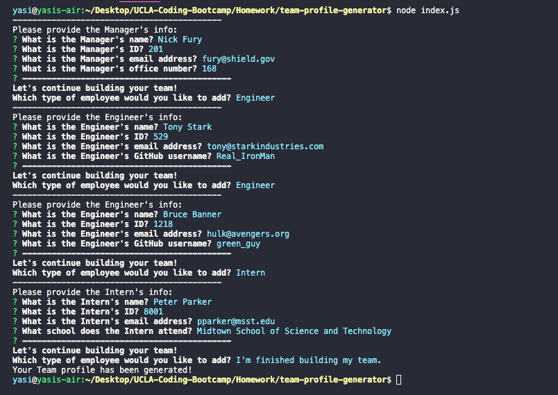

# Team Profile Generator

## Description

The goal of this assignment was to create a Node.js command-line application that generates an HTML webpage with employee information provided by the user. This application uses the [Inquirer](https://www.npmjs.com/package/inquirer) package to collect input from the user

## User Story

```md
"As a manager, I want to generate a webpage that displays my team's basic info so that I have quick access to their emails and GitHub profiles."
```

## Acceptance Criteria

```md
GIVEN a command-line application that accepts user input
WHEN I am prompted for my team members and their information
THEN an HTML file is generated that displays a nicely formatted team roster based on user input
WHEN I click on an email address in the HTML
THEN my default email program opens and populates the TO field of the email with the address
WHEN I click on the GitHub username
THEN that GitHub profile opens in a new tab
WHEN I start the application
THEN I am prompted to enter the team manager’s name, employee ID, email address, and office number
WHEN I enter the team manager’s name, employee ID, email address, and office number
THEN I am presented with a menu with the option to add an engineer or an intern or to finish building my team
WHEN I select the engineer option
THEN I am prompted to enter the engineer’s name, ID, email, and GitHub username, and I am taken back to the menu
WHEN I select the intern option
THEN I am prompted to enter the intern’s name, ID, email, and school, and I am taken back to the menu
WHEN I decide to finish building my team
THEN I exit the application, and the HTML is generated
```

## Usage

[Here](https://go-yasi.github.io/team-profile-generator/) is a link to deployed application.  
[Here](https://www.loom.com/share/011eae00f5bb4878ab2a7053f10c3c09) is a link to a video walkthrough demonstrating the application's functionality. 

## Mock-Up

The following image shows a mock-up of the generated HTML’s appearance and functionality:

  

The following image shows the command-line functions that generated the webpage above:



## Tests
Tests were provided with the assignment and can be found in the "test" folder.

